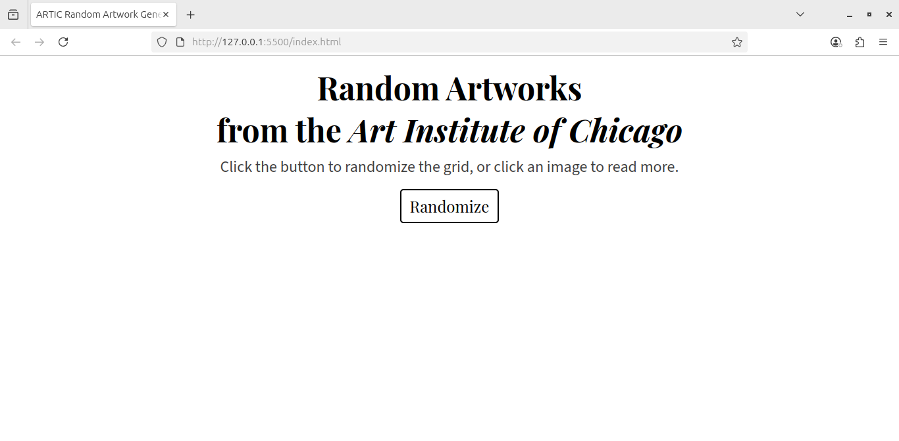
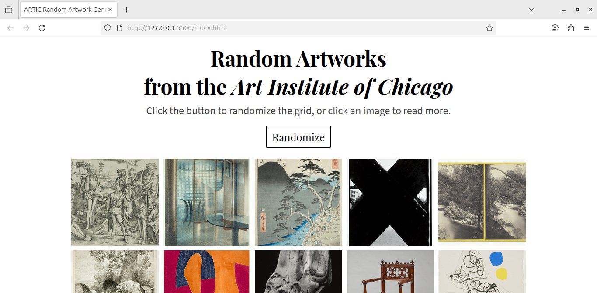
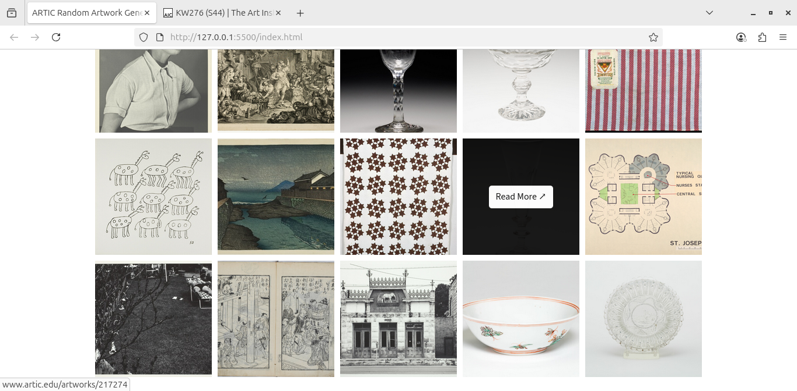

# ARTIC Random Artwork Generator

This is a simple web app that fetches 15 random artworks from the [Art Institute of Chicago](https://www.artic.edu/) (ARTIC) every time you click the "Randomize" button.
Each artwork is linked to its page on the ARTIC website where you can read more about it.

## Live Demo

You can find the web app hosted on Github Pages [here &nearr;](https://mrnng.github.io/artic/)

## Screenshots

## Inspiration

I wrote this project to practice using an API and the web development skills I'm learning.
I love art, and I wanted to make something that resembles a mood board and can possibly help you find your next inspiration.

## Technology Used

This is a simple web app, using only:

- HTML
- CSS
- JavaScript
- [ARTIC API](https://api.artic.edu/docs/)
